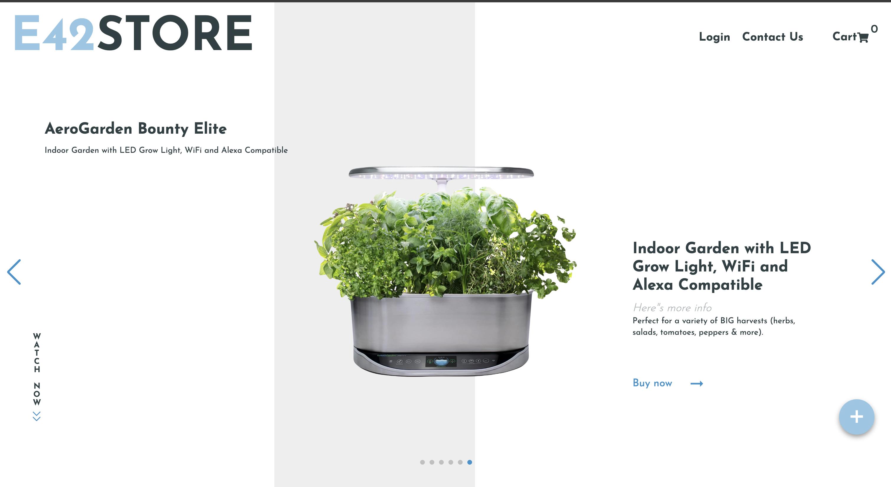
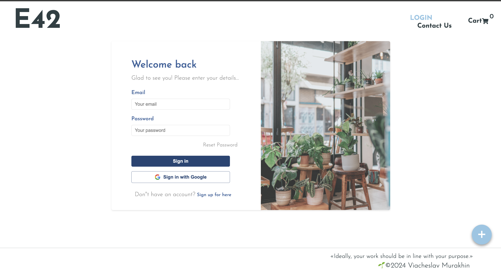
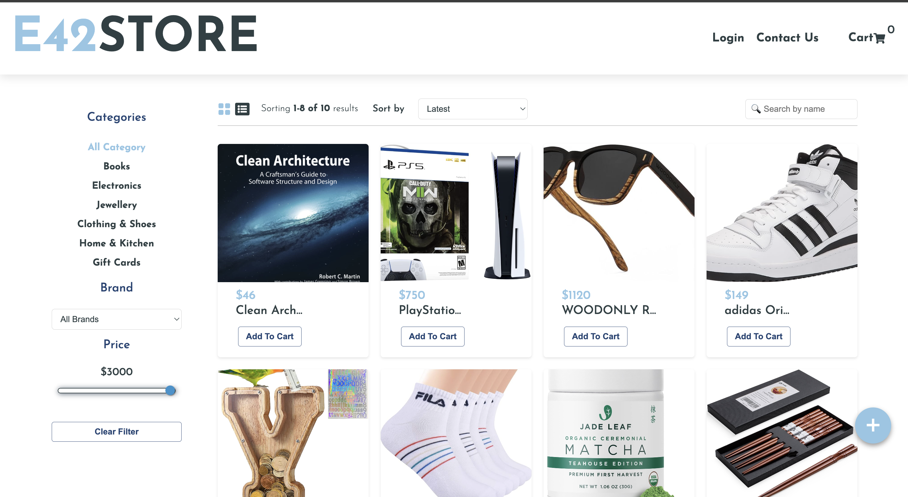
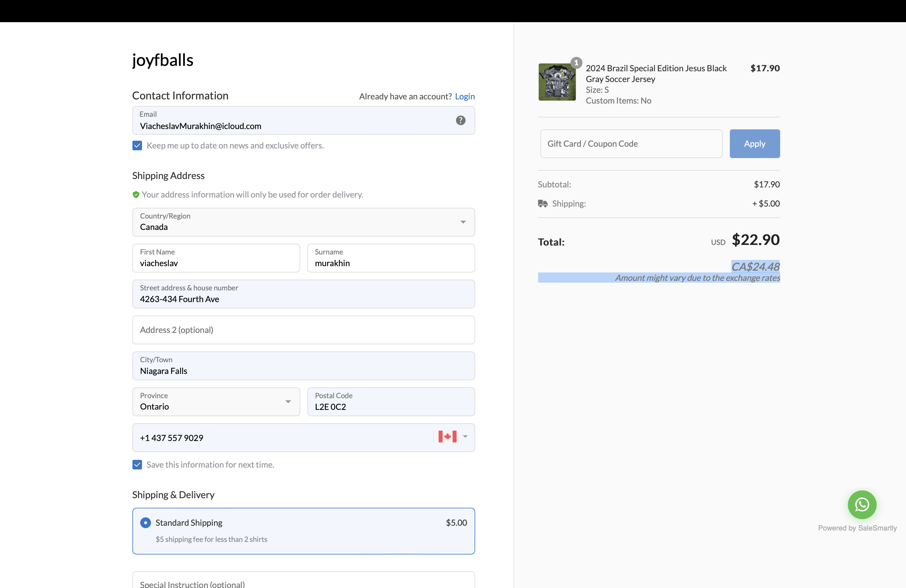

# e42sto®e 💻

e42store is a web application designed to provide an e-commerce platform with various functionalities, including user
authentication, payment processing, data visualization, and more. The project uses a combination of frontend and backend
technologies to deliver a seamless shopping experience.



  

## Table of Contents 🧾

1. [Project Structure](#project-structure)
2. [Dependencies](#dependencies)
3. [Scripts](#scripts)
4. [Configuration](#configuration)
5. [Usage](#usage)
6. [Development](#development)
7. [Build](#build)
8. [Testing](#testing)
9. [Contributing](#contributing)
10. [License](#license)

## Project Structure 🌿

The project consists of the following main directories and files:

### `public/`

This directory contains static files such as HTML, images, and other assets.

- `favicon.ico`: Icon displayed in the browser tab.
- `index.html`: Main HTML file.
- `logo192.png`: 192x192 logo image.
- `logo512.png`: 512x512 logo image.

### `src/`

This directory contains the main frontend code, including React components, Redux slices, and other related files.

- `.tsx`: TypeScript React components.
- `assets/`: Assets used in the application.
- `components/`: Reusable React components.
- `customHooks/`: Custom React hooks.
- `declarations.d.ts`: TypeScript declaration file.
- `firebase/`: Firebase configuration and utilities.
- `index.scss`: Main SCSS stylesheet.
- `index.tsx`: Entry point for the React application.
- `pages/`: React components for different pages.
- `product.type.ts`: TypeScript type definitions for products.
- `redux/`: Redux slices and store configuration.
- `route/`: Route definitions for the application.

### `server.js`

This file contains the setup for the Express server.

### `package.json`

This file contains the project configuration and dependencies.

### `package-lock.json`

## Dependencies ⬇︎

### Frontend Dependencies

- **React**: A JavaScript library for building user interfaces.
- **React-DOM**: Serves as the entry point to the DOM and server renderers for React.
- **React-Redux**: Official React bindings for Redux.
- **React-Router-DOM**: Declarative routing for React applications.
- **React-Scripts**: Scripts and configuration used by Create React App.
- **Chart.js**: Simple yet flexible JavaScript charting for designers & developers.
- **React-Chartjs-2**: React wrapper for Chart.js.
- **React-Icons**: Include popular icons in your React projects easily.
- **React-Country-Region-Selector**: A component for selecting countries and regions.
- **React-Toastify**: For displaying beautiful notifications.
- **React-Star-Rate**: Component for star ratings.
- **Swiper**: Modern mobile touch slider.
- **Firebase**: JavaScript library for Firebase.
- **Stripe**: JavaScript library for Stripe.
- **@stripe/react-stripe-js**: React components for Stripe.js.
- **@stripe/stripe-js**: Load Stripe.js.

### Backend Dependencies

- **Express**: Fast, unopinionated, minimalist web framework for Node.js.
- **Cors**: Middleware for enabling CORS (Cross-Origin Resource Sharing).
- **Dotenv**: Loads environment variables from a `.env` file.
- **Stripe**: Node.js library for Stripe.

### Development Dependencies

- **Nodemon**: Utility that monitors for any changes in your source and automatically restarts your server.
- **Typescript**: Typed JavaScript at Any Scale.
- **Sass**: CSS extension language.
- **ESLint**: Pluggable and configurable linter tool for identifying and reporting on patterns in JavaScript.
- **@babel/plugin-proposal-private-property-in-object**: Babel plugin for private properties in objects.
- **@types**: TypeScript definitions for various libraries.

## Scripts

- **start:frontend&backend**: Starts both the frontend and backend concurrently.
- **start:frontend**: Starts only the frontend.
- **start:backend**: Starts only the backend.
- **start**: Starts the backend server.
- **build**: Builds the React app for production.
- **test**: Runs the test suite.
- **eject**: Ejects the configuration from Create React App.

## Configuration

### Environment Variables

> The project uses environment variables for configuration. Create a `.env` file in the root of your project with the
> following variables:

```
REACT_APP_FIREBASE_API_KEY=your_firebase_api_key
REACT_APP_FIREBASE_AUTH_DOMAIN=your_firebase_auth_domain
REACT_APP_FIREBASE_PROJECT_ID=your_firebase_project_id
REACT_APP_FIREBASE_STORAGE_BUCKET=your_firebase_storage_bucket
REACT_APP_FIREBASE_MESSAGING_SENDER_ID=your_firebase_messaging_sender_id
REACT_APP_FIREBASE_APP_ID=your_firebase_app_id
REACT_APP_STRIPE_PUBLIC_KEY=your_stripe_public_key
STRIPE_SECRET_KEY=your_stripe_secret_key
```

## Usage

To run the project locally:

1. Clone the repository:

```
git clone https://github.com/yourusername/e42store.git
      cd e42store
```

2. Install dependencies:

```
npm install
```

3. Create a .env file in the root directory and add your environment variables.
4. Start the development server:

```
npm run start:frontend&backend
```

## Development

### Frontend

The frontend of the project is built using React. To start the frontend development server:

```
npm run start:frontend
```

### Backend

The backend of the project is built using Express. To start the backend server:

```
npm run start:backend
```

## Build

To create a production build of the frontend:

```
npm run build
```

## Testing

To run the test suite:

```
npm run test
```

## Contributing

Contributions are welcome! Please read the contributing guidelines before getting started.

Please see [CONTRIBUTING.md](CONTRIBUTING.md) for details on how to contribute to this project.

## License

This project is licensed under the MIT License - see the LICENSE file for details.

This README provides a comprehensive overview of the e42store project, including its structure,
dependencies, scripts, and more.

```
This README provides a comprehensive overview of the e42store project, including its structure, dependencies, scripts, and more.
```